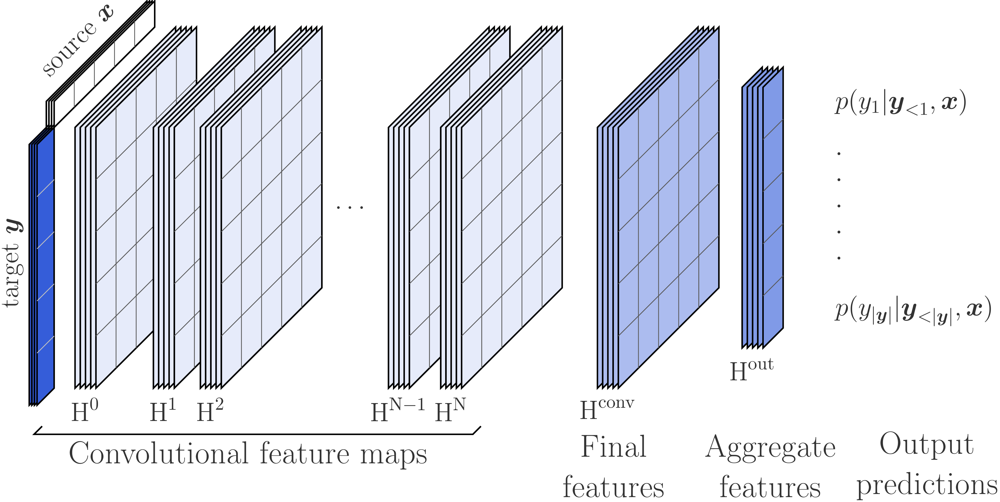
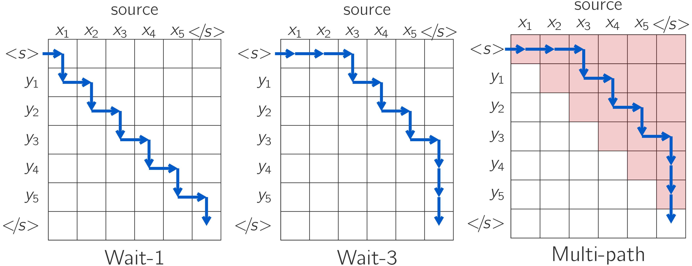

## Pervasive Attention - 2D Convolutional Neural Networks for Sequence-to-Sequence Prediction 
An NMT models with two-dimensional convolutions to jointly encode the source and the target sequences. 

For more details check the [paper](https://arxiv.org/abs/1808.03867).

<p align="center">
  
</p>

### Training Pervasive Attention for IWSLT'14 De-En:

#### Download and pre-process the dataset:

```shell
# Download and prepare the data
cd examples/translation/
bash prepare-iwslt14.sh
cd ../..

# Preprocess/binarize the data
TEXT=examples/translation/iwslt14.tokenized.de-en
fairseq-preprocess --source-lang de --target-lang en \
    --trainpref $TEXT/train --validpref $TEXT/valid --testpref $TEXT/test \
    --destdir data-bin/iwslt14.tokenized.de-en \
    --workers 20
```

#### Train Pervasive Attention on the pre-processed data:

```shell
MODEL=pa_iwslt_de_en
mkdir -p checkpoints/$MODEL
mkdir -p logs
CUDA_VISIBLE_DEVICES=0 python train.py data-bin/iwslt14.tokenized.de-en -s de -t en \
    --user-dir examples/pervasive --arch pervasive \
    --max-source-positions 100  --max-target-positions 100 \
    --left-pad-source False --skip-invalid-size-inputs-valid-test \
    --save-dir checkpoints/$MODEL --tensorboard-logdir logs/$MODEL\
    --seed 1 --memory-efficient --no-epoch-checkpoints --no-progress-bar --log-interval 10 \
    --optimizer adam --adam-betas '(0.9, 0.98)' --weight-decay 0.0001 \
    --max-tokens 600 --update-freq 14 --max-update 50000 \
    --lr-scheduler inverse_sqrt --warmup-updates 4000 --warmup-init-lr '1e-07' --lr 0.002 \
    --min-lr '1e-9' --criterion label_smoothed_cross_entropy --label-smoothing 0.1 \
    --convnet resnet --conv-bias --num-layers 14 --kernel-size 11  \
    --aggregator gated-max --add-positional-embeddings --share-decoder-input-output-embed
```

#### Evaluate on the test set:

```shell
CUDA_VISIBLE_DEVICES=0 python generate.py data-bin/iwslt14.tokenized.de-en \
    -s de -t en --gen-subset test \
    --path checkpoints/pa_iwslt_de_en/checkpoint_best.pt \
    --model-overrides "{'max_source_positions': 1024, 'max_target_positions': 1024}" --left-pad-source False  \
    --user-dir examples/pervasive --no-progress-bar \
    --max-tokens 8000 --beam 5 --remove-bpe 

```

### Download pre-trained models

Description | Dataset | Model | Test BLEU 
:---:|:---:|:---:|:---:
IWSLT'14 De-En | [binary data](https://drive.google.com/file/d/14LqJjPoxJ1VJqJdRpjsXHrfG72SY8M2V/view?usp=sharing) | [model.pt](https://drive.google.com/file/d/1293wkEn21ZMMfr9cbG4BrxE2B9wKCu41/view?usp=sharing) | 34.7

**Evaluate with:**

```shell
CUDA_VISIBLE_DEVICES=0 python generate.py PATH_to_data_directory \
    -s de -t en --gen-subset test \
    --path PATH_to_model.pt \
    --model-overrides "{'max_source_positions': 1024, 'max_target_positions': 1024}" --left-pad-source False  \
    --user-dir examples/pervasive --no-progress-bar \
    --max-tokens 8000 --beam 5  --remove-bpe

```


## Wait-k decoding with Pervasive Attention 

<p align="center">
  
</p>


### Training Wait-k Pervasive Attention for IWSLT'14 De-En:

```shell
k=7
MODEL=pa_wait${k}_iwslt_deen
mkdir -p checkpoints/$MODEL
mkdir -p logs
CUDA_VISIBLE_DEVICES=0 python train.py data-bin/iwslt14.tokenized.de-en -s de -t en \
    --user-dir examples/pervasive --arch pervasive \
    --max-source-positions 100  --max-target-positions 100 \
    --left-pad-source False --skip-invalid-size-inputs-valid-test \
    --save-dir checkpoints/$MODEL --tensorboard-logdir logs/$MODEL \
    --seed 1 --memory-efficient --no-epoch-checkpoints --no-progress-bar --log-interval 10  \
    --optimizer adam --adam-betas '(0.9, 0.98)' --weight-decay 0.0001 \
    --max-tokens 600 --update-freq 14 --max-update 50000 \
    --lr-scheduler inverse_sqrt --warmup-updates 4000 --warmup-init-lr '1e-07' --lr 0.002 \
    --min-lr '1e-9' --criterion label_smoothed_cross_entropy --label-smoothing 0.1 \
    --convnet resnet --conv-bias --num-layers 14 --kernel-size 11  \
    --add-positional-embeddings --share-decoder-input-output-embed \
    --aggregator path-gated-max --waitk $k --unidirectional
```

#### Evaluate on the test set:

```shell
k=5 # Evaluation time k
CUDA_VISIBLE_DEVICES=0 python generate.py data-bin/iwslt14.tokenized.de-en \
    -s de -t en --gen-subset test \
    --path checkpoints/pa_wait7_iwslt_deen/checkpoint_best.pt --task waitk_translation --eval-waitk $k \
    --model-overrides "{'max_source_positions': 1024, 'max_target_positions': 1024}" --left-pad-source False  \
    --user-dir examples/pervasive --no-progress-bar \
    --max-tokens 8000 --remove-bpe --beam 1
```

### Download pre-trained models

Description | Dataset | Model 
:---:|:---:|:---:
IWSLT'14 De-En | [binary data](https://drive.google.com/file/d/14LqJjPoxJ1VJqJdRpjsXHrfG72SY8M2V/view?usp=sharing) | [model.pt](https://drive.google.com/file/d/1YJbqxk5kqAzscx4SAOnTGCvG-QranKDa/view?usp=sharingv) 

**Evaluate with:**

```shell
k=5 # Evaluation time k
CUDA_VISIBLE_DEVICES=0 python generate.py PATH_to_data_directory  \
    -s de -t en --gen-subset test \
    --path PATH_to_model.pt --task waitk_translation --eval-waitk $k \
    --model-overrides "{'max_source_positions': 1024, 'max_target_positions': 1024}" --left-pad-source False  \
    --user-dir examples/pervasive --no-progress-bar \
    --max-tokens 8000 --remove-bpe --beam 1
```

## Citation:
```bibtex
@InProceedings{elbayad18conll,
    author ="Elbayad, Maha and Besacier, Laurent and Verbeek, Jakob",
    title = "Pervasive Attention: 2D Convolutional Neural Networks for Sequence-to-Sequence Prediction",
    booktitle = "Proceedings of the 22nd Conference on Computational Natural Language Learning",
    year = "2018",
 }
```

```bibtex
@article{elbayad20waitk,
    title={Efficient Wait-k Models for Simultaneous Machine Translation},
    author={Elbayad, Maha and Besacier, Laurent and Verbeek, Jakob},
    journal={arXiv preprint arXiv:2005.08595},
    year={2020}
}
```
