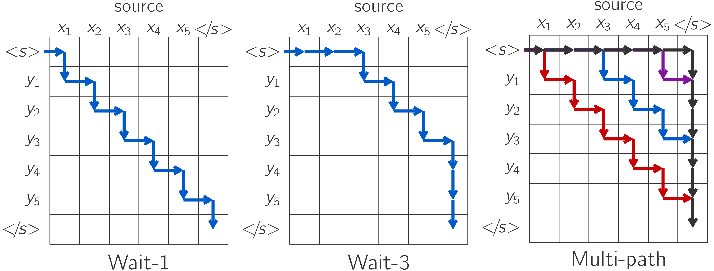

## Wait-k decoding with Transformer models

<p align="center">
  
</p>


### Training for IWSLT'14 De-En:

#### Download and pre-process the dataset:

```shell
# Download and prepare the data
cd examples/translation/
bash prepare-iwslt14.sh
cd ../..

# Preprocess/binarize the data
TEXT=examples/translation/iwslt14_deen_bpe10k
fairseq-preprocess --source-lang de --target-lang en \
    --trainpref $TEXT/train --validpref $TEXT/valid --testpref $TEXT/test \
    --destdir data-bin/iwslt14.tokenized.de-en \
    --workers 20
```

#### Train wait-k on the pre-processed data:

```shell
k=7
MODEL=tf_wait${k}_iwslt_deen
mkdir -p checkpoints/$MODEL
mkdir -p logs
CUDA_VISIBLE_DEVICES=0 python train.py data-bin/iwslt14.tokenized.de-en -s de -t en --left-pad-source False \
    --user-dir examples/waitk --arch waitk_transformer_small \
    --save-dir checkpoints/$MODEL --tensorboard-logdir logs/$MODEL \
    --seed 1 --no-epoch-checkpoints --no-progress-bar --log-interval 10  \
    --optimizer adam --adam-betas '(0.9, 0.98)' --weight-decay 0.0001 \
    --max-tokens 4000 --update-freq 2 --max-update 50000 \
    --lr-scheduler inverse_sqrt --warmup-updates 4000 --warmup-init-lr '1e-07' --lr 0.002 \
    --min-lr '1e-9' --criterion label_smoothed_cross_entropy --label-smoothing 0.1 \
    --share-decoder-input-output-embed --waitk  $k
```


#### Train multi-path on the pre-processed data:

```shell
MODEL=tf_multipath_iwslt_deen
mkdir -p checkpoints/$MODEL
mkdir -p logs
CUDA_VISIBLE_DEVICES=0 python train.py data-bin/iwslt14.tokenized.de-en -s de -t en --left-pad-source False \
    --user-dir examples/waitk --arch waitk_transformer_small \
    --save-dir checkpoints/$MODEL --tensorboard-logdir logs/$MODEL \
    --seed 1 --no-epoch-checkpoints --no-progress-bar --log-interval 10  \
    --optimizer adam --adam-betas '(0.9, 0.98)' --weight-decay 0.0001 \
    --max-tokens 4000 --update-freq 2 --max-update 50000 \
    --lr-scheduler inverse_sqrt --warmup-updates 4000 --warmup-init-lr '1e-07' --lr 0.002 \
    --min-lr '1e-9' --criterion label_smoothed_cross_entropy --label-smoothing 0.1 \
    --share-decoder-input-output-embed --multi-waitk 
```


#### Evaluate on the test set:

```shell
k=5 # Evaluation time k
CUDA_VISIBLE_DEVICES=0 python generate.py data-bin/iwslt14.tokenized.de-en \
    -s de -t en --gen-subset test \
    --path checkpoints/pa_wait7_iwslt_deen/checkpoint_best.pt --task waitk_translation --eval-waitk $k \
    --model-overrides "{'max_source_positions': 1024, 'max_target_positions': 1024}" --left-pad-source False  \
    --user-dir examples/waitk --no-progress-bar \
    --max-tokens 8000 --remove-bpe --beam 1
```

### Download pre-trained models

Description | Dataset | Model 
:---:|:---:|:---:
IWSLT'14 De-En | [binary data](https://drive.google.com/file/d/14LqJjPoxJ1VJqJdRpjsXHrfG72SY8M2V/view?usp=sharing) | [model.pt](https://drive.google.com/file/d/1hY9JMbSh66KgHQxRfDjRaqr49x-jZ5qZ/view?usp=sharing)

**Evaluate with:**

```shell
tar xzf iwslt14_de_en.tar.gz
tar xzf tf_waitk_model.tar.gz

k=5 # Evaluation time k
output=wait$k.log
CUDA_VISIBLE_DEVICES=0 python generate.py PATH_to_data_directory  \
    -s de -t en --gen-subset test \
    --path PATH_to_model.pt --task waitk_translation --eval-waitk $k \
    --model-overrides "{'max_source_positions': 1024, 'max_target_positions': 1024}" --left-pad-source False  \
    --user-dir examples/waitk --no-progress-bar \
    --max-tokens 8000 --remove-bpe --beam 1 2>&1 | tee -a $output
python PATH_to_examples/waitk/eval_delay.py $output
```


```bibtex
@article{elbayad20waitk,
    title={Efficient Wait-k Models for Simultaneous Machine Translation},
    author={Elbayad, Maha and Besacier, Laurent and Verbeek, Jakob},
    journal={arXiv preprint arXiv:2005.08595},
    year={2020}
}
```

